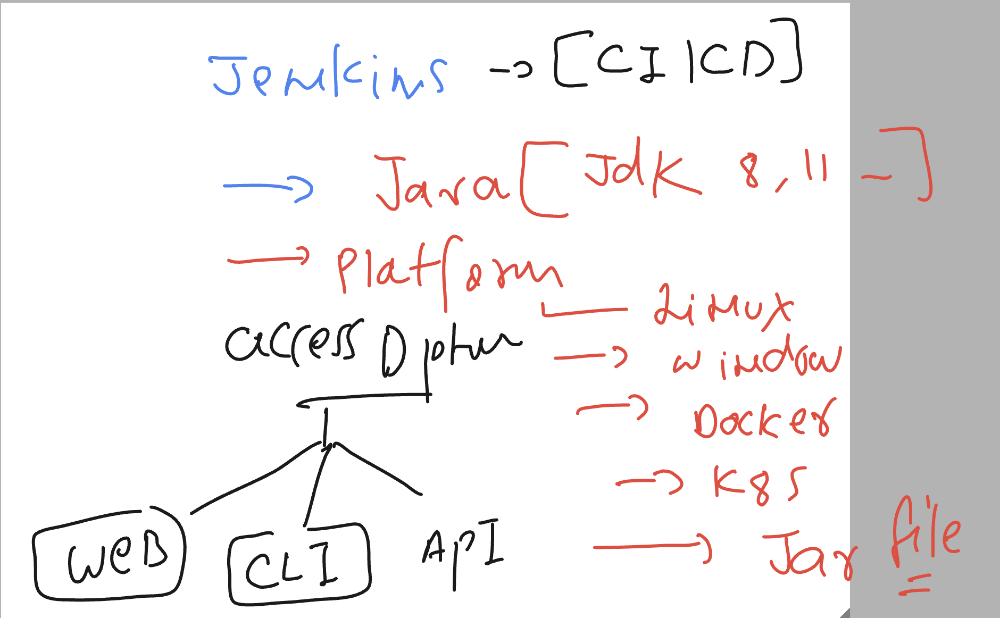
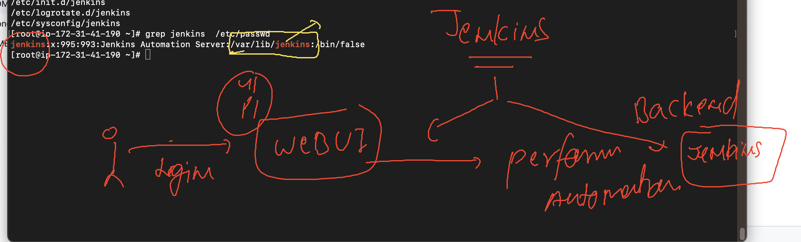

# cloud4c_jenkinsb1

### info  jenkins 



## Installing jenkins in Linux platform 

### login to linux machine 

```
  Downloads ssh -i "ashu-jenkins-key.pem" ec2-user@ec2-35-154-184-13.ap-south-1.compute.amazonaws.com  
The authenticity of host 'ec2-35-154-184-13.ap-south-1.compute.amazonaws.com (35.154.184.13)' can't be established.
ED25519 key fingerprint is SHA256:k/KOw9uMfkBMIato0bWOSRm6YbKpSrKCdUoEEanTu+E.
This key is not known by any other names
Are you sure you want to continue connecting (yes/no/[fingerprint])? yes
Warning: Permanently added 'ec2-35-154-184-13.ap-south-1.compute.amazonaws.com' (ED25519) to the list of known hosts.
@@@@@@@@@@@@@@@@@@@@@@@@@@@@@@@@@@@@@@@@@@@@@@@@@@@@@@@@@@@
@         WARNING: UNPROTECTED PRIVATE KEY FILE!          @
@@@@@@@@@@@@@@@@@@@@@@@@@@@@@@@@@@@@@@@@@@@@@@@@@@@@@@@@@@@
Permissions 0644 for 'ashu-jenkins-key.pem' are too open.
It is required that your private key files are NOT accessible by others.
This private key will be ignored.
Load key "ashu-jenkins-key.pem": bad permissions
ec2-user@ec2-35-154-184-13.ap-south-1.compute.amazonaws.com: Permission denied (publickey,gssapi-keyex,gssapi-with-mic).
➜  Downloads 
➜  Downloads chmod 400 ashu-jenkins-key.pem
➜  Downloads 
➜  Downloads ssh -i "ashu-jenkins-key.pem" ec2-user@ec2-35-154-184-13.ap-south-1.compute.amazonaws.com  

       __|  __|_  )
       _|  (     /   Amazon Linux 2 AMI
      ___|\___|___|

https://aws.amazon.com/amazon-linux-2/
-bash: warning: setlocale: LC_CTYPE: cannot change locale (UTF-8): No such file or directory
[ec2-user@ip-172-31-41-190 ~]$ whoami
ec2-user
[ec2-user@ip-172-31-41-190 ~]$ sudo -i
[root@ip-172-31-41-190 ~]# whoami
root

```

## Steps to Install jenkins in Redhat / centos / amazon linux 

### Link details 

[click_here](https://www.jenkins.io/doc/tutorials/tutorial-for-installing-jenkins-on-AWS/)


### step 1 -- update & upgrade software

```
root@ip-172-31-41-190 ~]# yum update
Failed to set locale, defaulting to C
Loaded plugins: extras_suggestions, langpacks, priorities, update-motd
amzn2-core                                                                                                            | 3.7 kB  00:00:00     
No packages marked for update
[root@ip-172-31-41-190 ~]# yum upgrade
Failed to set locale, defaulting to C
Loaded plugins: extras_suggestions, langpacks, priorities, update-motd
No packages marked for update
[root@ip-172-31-41-190 ~]# 


```

### Step 2 : creating repo for jenkins software

```
sudo wget -O /etc/yum.repos.d/jenkins.repo \
>     https://pkg.jenkins.io/redhat-stable/jenkins.repo
```

### step 3 installing key 

```
 sudo rpm --import https://pkg.jenkins.io/redhat-stable/jenkins.io-2023.key
```

### step 4 

```
sudo amazon-linux-extras install java-openjdk11 -y
```

### step 5 

```
[root@ip-172-31-41-190 ~]# sudo yum install jenkins -y
Failed to set locale, defaulting to C
Loaded plugins: extras_suggestions, langpacks, priorities, update-motd
Resolving Dependencies
--> Running transaction check
---> Package jenkins.noarch 0:2.401.1-1.1 will be installed
--> Finished Dependency Resolution

Dependencies Resolved

=============================================================================================================================================
 Package                         Arch                           Version                                Repository                       Size
=============================================================================================================================================
Installing:
 jenkins                         noarch                         2.401.1-1.1                            jenkins                          94 M


```

### start service

```
[root@ip-172-31-41-190 ~]# sudo systemctl enable jenkins
Created symlink from /etc/systemd/system/multi-user.target.wants/jenkins.service to /usr/lib/systemd/system/jenkins.service.
[root@ip-172-31-41-190 ~]# 
[root@ip-172-31-41-190 ~]# sudo systemctl start jenkins
```

## Verify installation 

```
[root@ip-172-31-41-190 ~]# rpm -qa jenkins* 
jenkins-2.401.1-1.1.noarch
[root@ip-172-31-41-190 ~]# 
[root@ip-172-31-41-190 ~]# rpm -qc  jenkins
/etc/init.d/jenkins
/etc/logrotate.d/jenkins
/etc/sysconfig/jenkins
[root@ip-172-31-41-190 ~]# grep jenkins  /etc/passwd
jenkins:x:995:993:Jenkins Automation Server:/var/lib/jenkins:/bin/false
[root@ip-172-31-41-190 ~]# 


```
## Understanding user story in jenkins




