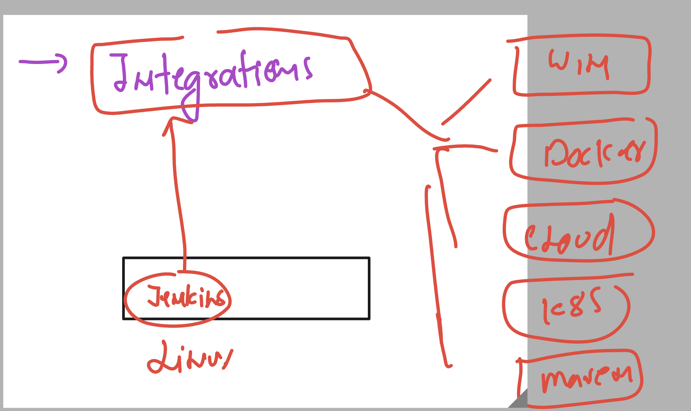
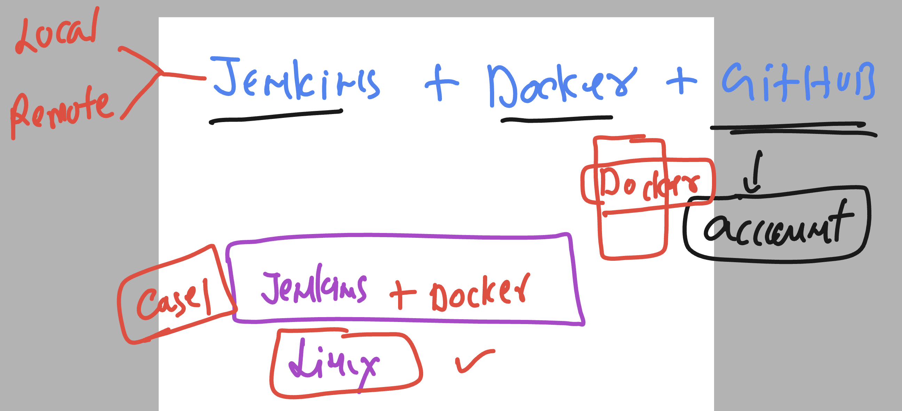
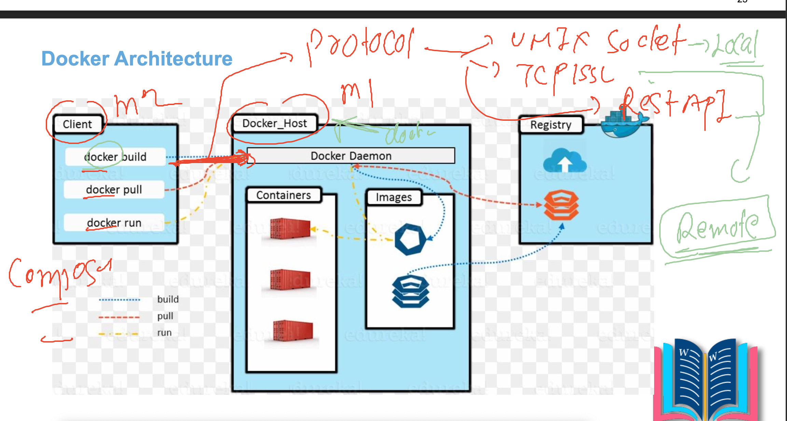
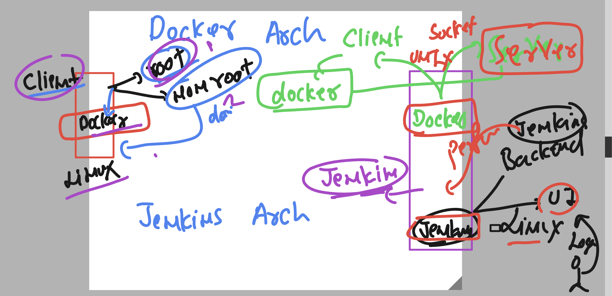
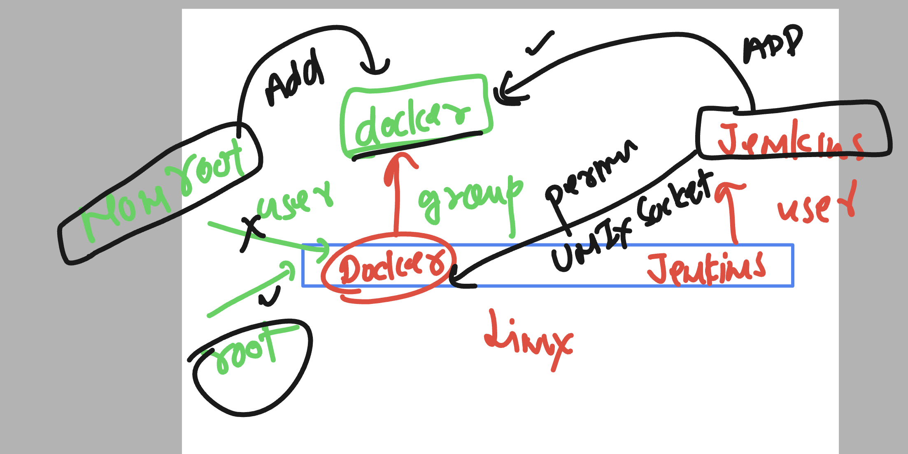

# cloud4c_jenkinsb1

### Verify jenkins status 

```
[ec2-user@ip-172-31-41-190 ~]$ rpm -qa jenkins*
jenkins-2.401.1-1.1.noarch
[ec2-user@ip-172-31-41-190 ~]$ systemctl status jenkins
● jenkins.service - Jenkins Continuous Integration Server
   Loaded: loaded (/usr/lib/systemd/system/jenkins.service; enabled; vendor preset: disabled)
   Active: active (running) since Wed 2023-06-21 03:39:19 UTC; 4min 10s ago
 Main PID: 3043 (java)
   CGroup: /system.slice/jenkins.service
           └─3043 /usr/bin/java -

===>
[ec2-user@ip-172-31-41-190 ~]$ grep jenkins /etc/passwd
jenkins:x:995:993:Jenkins Automation Server:/var/lib/jenkins:/bin/false
[ec2-user@ip-172-31-41-190 ~]$ 

```

## Integration of jenkins 




### jenkins + docker integration cases



## Steps 

### installing docker on the same machine

```
ec2-user@ip-172-31-41-190 ~]$ sudo yum install docker -y
Failed to set locale, defaulting to C
Loaded plugins: extras_suggestions, langpacks, priorities, update-motd
amzn2-core                                                                                                            | 3.7 kB  00:00:00     
Resolving Dependencies
--> Running transaction check
---> Package docker.x86_64 0:20.10.23-1.amzn2.0.1 will be installed
--> Processing Dependency: runc >= 1.0.0 for package: docker-20.10.23-1.amzn2.0.1.x86_64
--> Processing Dependency: libcgroup >= 0.40.rc1-5.15 f
```

### starting docker service 

```
[ec2-user@ip-172-31-41-190 ~]$ rpm -qa docker*
docker-20.10.23-1.amzn2.0.1.x86_64
[ec2-user@ip-172-31-41-190 ~]$ sudo systemctl start docker
[ec2-user@ip-172-31-41-190 ~]$ sudo systemctl enable  docker
Created symlink from /etc/systemd/system/multi-user.target.wants/docker.service to /usr/lib/systemd/system/docker.service.
[ec2-user@ip-172-31-41-190 ~]$ 
[ec2-user@ip-172-31-41-190 ~]$ sudo systemctl status   docker
● docker.service - Docker Application Container Engine
   Loaded: loaded (/usr/lib/systemd/system/docker.service; enabled; vendor preset: disabled)
   Active: active (running) since Wed 2023-06-21 04:05:58 UTC; 11s ago
     Docs: https://docs.docker.com
 Main PID: 18201 (dockerd)

```

## Understanding integration 

### Docker arch of server and client 



### docker on local system only allow root user to access docker server

```
[ec2-user@ip-172-31-41-190 ~]$ whoami
ec2-user
[ec2-user@ip-172-31-41-190 ~]$ docker version 
Client:
 Version:           20.10.23
 API version:       1.41
 Go version:        go1.18.9
 Git commit:        7155243
 Built:             Tue Apr 11 22:56:36 2023
 OS/Arch:           linux/amd64
 Context:           default
 Experimental:      true
Got permission denied while trying to connect to the Docker daemon socket at unix:///var/run/docker.sock: Get "http://%2Fvar%2Frun%2Fdocker.sock/v1.24/version": dial unix /var/run/docker.sock: connect: permission denied
[ec2-user@ip-172-31-41-190 ~]$ 
[ec2-user@ip-172-31-41-190 ~]$ 
[ec2-user@ip-172-31-41-190 ~]$ sudo -i
[root@ip-172-31-41-190 ~]# whoami
root
[root@ip-172-31-41-190 ~]# docker version 
Client:
 Version:           20.10.23
 API version:       1.41
 Go version:        go1.18.9
 Git commit:        7155243
 Built:             Tue Apr 11 22:56:36 2023
 OS/Arch:           linux/amd64
 Context:           default
 Experimental:      true

Server:
 Engine:
  Version:          20.10.23
  API version:      1.41 (minimum version 1.12)
  Go version:       go1.18.9
  Git commit:       6051f14
  Built:            Tue Apr 11 22:57:17 2023
  OS/Arch:          linux/amd64
  Experimental:     false
 containerd:
  Version:          1.6.19

```

### jenkins with docker 



### understanding group and unix socket 



### adduser to docker group 

```
[root@ip-172-31-41-190 ~]# grep  docker  /etc/group
docker:x:991:
[root@ip-172-31-41-190 ~]# 
[root@ip-172-31-41-190 ~]# 
[root@ip-172-31-41-190 ~]# usermod -G docker  ec2-user
[root@ip-172-31-41-190 ~]# usermod -G docker  jenkins
[root@ip-172-31-41-190 ~]# 
[root@ip-172-31-41-190 ~]# grep  docker  /etc/group
docker:x:991:ec2-user,jenkins
[root@ip-172-31-41-190 ~]# 


```
