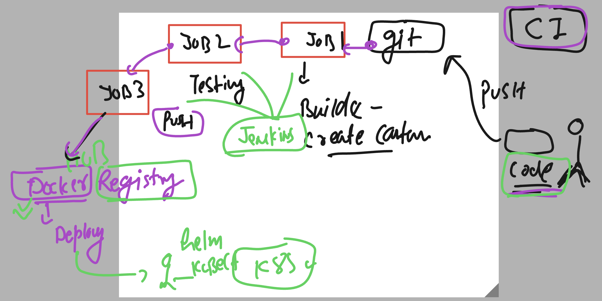

# cloud4c_jenkinsb1

## lab status 

```
ec2-user@ip-172-31-41-190 ~]$ systemctl status  docker jenkins 
● docker.service - Docker Application Container Engine
   Loaded: loaded (/usr/lib/systemd/system/docker.service; enabled; vendor preset: disabled)
   Active: active (running) since Thu 2023-06-22 03:09:57 UTC; 26min ago
     Docs: https://docs.docker.com
  Process: 3276 ExecStartPre=/usr/libexec/docker/docker-setup-runtimes.sh (code=exited, status=0/SUCCESS)
  Process: 3255 ExecStartPre=/bin/mkdir -p /run/docker (code=exited, status=0/SUCCESS)
 Main PID: 3280 (dockerd)
    Tasks: 8
   Memory: 88.2M
   CGroup: /system.slice/docker.service
           └─3280 /usr/bin/dockerd -H fd:// --containerd=/run/containerd/containerd.sock --default-ulimit nofile=32768:65536

Warning: Journal has been rotated since unit was started. Log output is incomplete or unavailable.

● jenkins.service - Jenkins Continuous Integration Server
   Loaded: loaded (/usr/lib/systemd/system/jenkins.service; enabled; vendor preset: disabled)
   Active: active (running) since Thu 2023-06-22 03:10:11 UTC; 26min ago
 Main PID: 3048 (java)
    Tasks: 61
   Memory: 1.3G
   CGroup: /system.slice/jenkins.service

```

## Understanding pipeline jobs 


### using docker compose to build nad create image 

```
curl -SL https://github.com/docker/compose/releases/download/v2.19.0/docker-compose-linux-x86_64 -o /usr/bin/docker-compose
chmod +x /usr/bin/docker-compose
[root@ip-172-31-41-190 ~]# docker-compose -v
Docker Compose version v2.19.0

```

## Plugins in jenkins 


### Understanding CI 



### pipeline jobs manual configuration is done 


