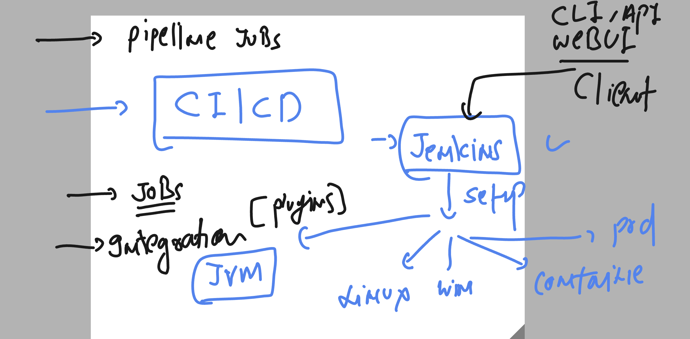
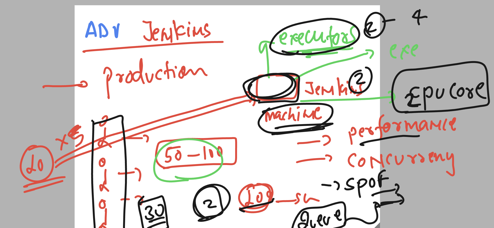
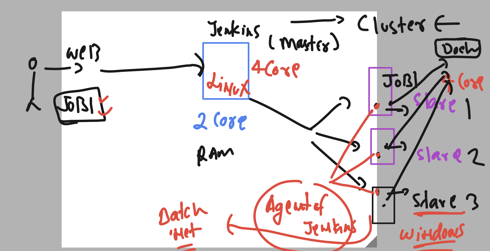

# cloud4c_jenkinsb1

## Revision 



### how run jenkins in a container to avoid installation 

```
[root@ip-172-31-12-245 ~]# docker run -itd --name jenkins -p 8080:8080 -v jenkins_data:/var/jenkins_home --restart always jenkins/jenkins:lts-jdk11  
Unable to find image 'jenkins/jenkins:lts-jdk11' locally
lts-jdk11: Pulling from jenkins/jenkins
bd73737482dd: Pull complete 
747b9186aa97: Pull complete

```

### checking default password for installation 

```
root@ip-172-31-12-245 ~]# docker logs jenkins 
Running from: /usr/share/jenkins/jenkins.war
webroot: /var/jenkins_home/war
2023-06-23 03:47:38.577+0000 [id=1]	INFO	winstone.Logger#logInternal: Beginning extraction from war file
2023-06-23 03:47:39.836+0000 [id=1]	WARNING	o.e.j.s.handler.ContextHandler#setContextPath: Empty contextPath
2023-06-23 03:47:39.911+0000 [id=1]	INFO	org.eclipse.jetty.server.Server#doStart: jetty-10.

*************************************************************
*************************************************************

Jenkins initial setup is required. An admin user has been created and a password generated.
Please use the following password to proceed to installation:

895cf5d450784d229f0f5af0b25c3156

This may also be found at: /var/jenkins_home/secrets/initialAdminPassword


```

### Understanding prod grade jenkins and executors



### we can change executors number 

```
[root@ip-172-31-41-190 ~]# cd /var/lib/jenkins/
[root@ip-172-31-41-190 jenkins]# ls
%C                                           jenkins.model.JenkinsLocationConfiguration.xml             queue.xml.bak
config.xml                                   jenkins.telemetry.Correlator.xml                           secret.key
credentials.xml                              jobs                                                       secret.key.not-so-secret
fingerprints                                 logs                                                       secrets
hudson.model.UpdateCenter.xml                nodeMonitors.xml                                           updates
hudson.plugins.git.GitTool.xml               nodes                                                      userContent
identity.key.enc                             org.jenkinsci.plugins.workflow.flow.FlowExecutionList.xml  users
jenkins.install.InstallUtil.lastExecVersion  plugins                                                    workspace
jenkins.install.UpgradeWizard.state          queue.xml
[root@ip-172-31-41-190 jenkins]# 
[root@ip-172-31-41-190 jenkins]# 
[root@ip-172-31-41-190 jenkins]# grep -in exec  config.xml 
5:  <numExecutors>2</numExecutors>
28:      <filterExecutors>false</filterExecutors>
35:      <filterExecutors>false</filterExecutors>
[root@ip-172-31-41-190 jenkins]# lscpu  | grep -i cpu 
CPU op-mode(s):      32-bit, 64-bit
CPU(s):              2
On-line CPU(s) list: 0,1
CPU family:          6
Model name:          Intel(R) Xeon(R) CPU E5-2676 v3 @ 2.40GHz
CPU MHz:             2394.259
NUMA node0 CPU(s):   0,1
Flags:               fpu vme de pse tsc msr pae mce cx8 apic sep mtrr pge mca cmov pat pse36 clflush mmx fxsr sse sse2 ht syscall nx rdtscp lm constant_tsc rep_good nopl xtopology cpuid tsc_known_freq pni pclmulqdq ssse3 fma cx16 pcid sse4_1 sse4_2 x2apic movbe popcnt tsc_deadline_timer aes xsave avx f16c rdrand hypervisor lahf_lm abm cpuid_fault invpcid_single pti fsgsbase bmi1 avx2 smep bmi2 erms invpcid xsaveopt
[root@ip-172-31-41-190 jenkins]# vim config.xml 
[root@ip-172-31-41-190 jenkins]# systemctl daemon-reload 
[root@ip-172-31-41-190 jenkins]# systemctl restart jenkins
[root@ip-172-31-41-190 jenkins]# systemctl status jenkins
● jenkins.service - Jenkins Continuous Integration Server

```

### Jenkins master slave architecture 



## steps to install jenkins slave 

### install jdk 8 or later on slave machine 

```
  12  sudo amazon-linux-extras install java-openjdk11 -y
   13  history 
[root@ip-172-31-12-245 ~]# java -version 
openjdk version "11.0.19" 2023-04-18 LTS
OpenJDK Runtime Environment (Red_Hat-11.0.
```

### on slave create user and test it can run java 

```
[root@ip-172-31-12-245 ~]# useradd  ashu
[root@ip-172-31-12-245 ~]# passwd ashu
Changing password for user ashu.
New password: 
BAD PASSWORD: The password is shorter than 7 characters
Retype new password: 
passwd: all authentication tokens updated successfully.
[root@ip-172-31-12-245 ~]# 
[root@ip-172-31-12-245 ~]# su - ashu 
[ashu@ip-172-31-12-245 ~]$ 
[ashu@ip-172-31-12-245 ~]$ java -version 
openjdk version "11.0.19" 2023-04-18 LTS
OpenJDK Runtime Environment (Red_Hat-11.0.19.0.7-1.amzn2.0.1) (build 11.0.19+7-LTS)
OpenJDK 64-Bit Server VM (Red_Hat-11.0.19.0.7-1.amzn2.0.1) (build 11.0.19+7-LTS, mixed mode, sharing)
[ashu@ip-172-31-12-245 ~]$ 


```

### step on master machine 

### checking backend jenkins user 

```
[root@ip-172-31-41-190 jenkins]# 
[root@ip-172-31-41-190 jenkins]# grep jenkins  /etc/passwd
jenkins:x:995:993:Jenkins Automation Server:/var/lib/jenkins:/bin/false
[root@ip-172-31-41-190 jenkins]# 
[root@ip-172-31-41-190 jenkins]# su - jenkins 
Last login: Fri Jun 23 07:58:59 IST 2023 on pts/0
[root@ip-172-31-41-190 jenkins]# 

```

### assign shell temp to login on jenkins user 

```
root@ip-172-31-41-190 jenkins]# usermod -s /bin/bash jenkins 
[root@ip-172-31-41-190 jenkins]# 
[root@ip-172-31-41-190 jenkins]# 
[root@ip-172-31-41-190 jenkins]# grep jenkins  /etc/passwd
jenkins:x:995:993:Jenkins Automation Server:/var/lib/jenkins:/bin/bash
[root@ip-172-31-41-190 jenkins]# 
[root@ip-172-31-41-190 jenkins]# 
[root@ip-172-31-41-190 jenkins]# su - jenkins 
Last login: Fri Jun 23 09:54:57 IST 2023 on pts/2
-bash-4.2$ 
-bash-4.2$ 
-bash-4.2$ ssh-keygen   
Generating public/private rsa key pair.
Enter file in which to save the key (//.ssh/id_rsa): 
Enter passphrase (empty for no passphrase): 
Enter same passphrase again: 
Your identification has been saved in .ssh/id_rsa.
Your public key has been saved in /.ssh/id_rsa.pub.
The key fingerprint is:
SHA256:kYzjB8O+eYQj6Mv9anR7mNITcSRMkQrIWVOnScndfYM root@ip-172-31-12-245.ap-south-1.compute.internal
The key's randomart image is:

```

### master system jenkins user will transfer key to slave machine user

```
-bash-4.2$ ssh-copy-id   ashu@172.31.12.245
/usr/bin/ssh-copy-id: INFO: Source of key(s) to be installed: "/var/lib/jenkins/.ssh/id_rsa.pub"
The authenticity of host '172.31.12.245 (172.31.12.245)' can't be established.
ECDSA key fingerprint is SHA256:CNLrknQDPh7OWQP1dR5Ho5XbsbXtO83gKcFDLtjduuU.
ECDSA key fingerprint is MD5:b4:db:61:1d:0d:b7:86:2b:bf:12:c2:39:98:fe:25:54.
Are you sure you want to continue connecting (yes/no)? yes
/usr/bin/ssh-copy-id: INFO: attempting to log in with the new key(s), to filter out any that are already installed
/usr/bin/ssh-copy-id: INFO: 1 key(s) remain to be installed -- if you are prompted now it is to install the new keys
ashu@172.31.12.245's password: 

Number of key(s) added: 1

Now try logging into the machine, with:   "ssh 'ashu@172.31.12.245'"
and check to make sure that only the key(s) you wanted were added.


```

### verify by login without password

```
bash-4.2$ whoami
jenkins
-bash-4.2$ 
-bash-4.2$ 
-bash-4.2$ ssh  ashu@172.31.12.245
Last login: Fri Jun 23 04:22:17 2023

       __|  __|_  )
       _|  (     /   Amazon Linux 2 AMI
      ___|\___|___|

https://aws.amazon.com/amazon-linux-2/
[ashu@ip-172-31-12-245 ~]$ 
[ashu@ip-172-31-12-245 ~]$ whoami
ashu
[ashu@ip-172-31-12-245 ~]$ 

```

### remove shell access from jenkins user for security purpose 

```
[root@ip-172-31-41-190 jenkins]# usermod -s /bin/false  jenkins 
[root@ip-172-31-41-190 jenkins]# 
[root@ip-172-31-41-190 jenkins]# grep jenkins /etc/passwd
jenkins:x:995:993:Jenkins Automation Server:/var/lib/jenkins:/bin/false
[root@ip-172-31-41-190 jenkins]# 


```
