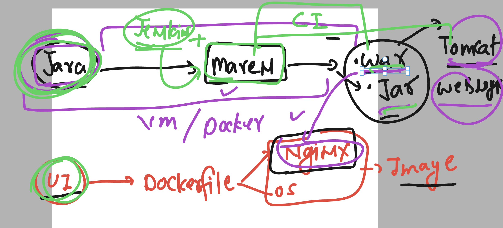

# cloud4c_jenkinsb1

### Revision 


### jenkinsfile more info 


## sample jenkins file

```
pipeline {
    agent any

    stages {
        stage('taking souce code from github') {
            steps {
                echo 'Hello World we are starting with github code'
                // lets use git option to clone data from repo 
                git 'https://github.com/redashu/ashu-cisco-webUI.git'
                // my slave nodes are linux so we use sh incase of windows we use bat
                sh 'ls '
                sh  'java -version'
            }
        }
        stage('checking docker connection'){
            steps {
                // using docker version 
                echo 'running docker command !..'
                sh 'docker version'
            }
        }
    }
}

```

### adding image build using compose 

```
pipeline {
    agent any

    stages {
        stage('taking souce code from github') {
            steps {
                echo 'Hello World we are starting with github code'
                // lets use git option to clone data from repo 
                git 'https://github.com/redashu/ashu-cisco-webUI.git'
                // my slave nodes are linux so we use sh incase of windows we use bat
                sh 'ls '
                sh  'java -version'
            }
        }
        stage('building image and create container'){
            steps {
                // using docker version 
                echo 'running docker command !..'
                sh 'docker version'
                sh 'docker-compose up -d --build'
                sh 'docker-compose ps'
                sh 'docker images'
            }
        }
    }
}

```

### adding more in jenkinsfile

```
pipeline {
    agent any

    stages {
        stage('taking souce code from github') {
            steps {
                echo 'Hello World we are starting with github code'
                // lets use git option to clone data from repo 
                git 'https://github.com/redashu/ashu-cisco-webUI.git'
                // my slave nodes are linux so we use sh incase of windows we use bat
                sh 'ls '
                sh  'java -version'
            }
        }
        stage('building image and create container'){
            steps {
                // using docker version 
                echo 'running docker command !..'
                sh 'docker version'
                sh 'docker-compose down'
                sh 'docker-compose up -d --build'
                sh 'docker-compose ps'
                sh 'docker images'
            }
        }
        stage('testing container status by access page'){
            steps {
                sh 'curl -f http://localhost:1990/health.html'
                // informing
                echo 'health page is working fine'
            }
        }
    }
}

```

### Java project builds


### maven & jenkins



### jenkins plugins with free style vs pipeline 


