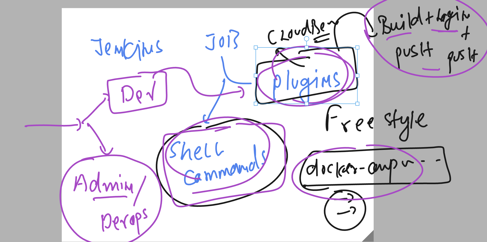

# cloud4c_jenkinsb1

### building java based webapp into .war using maven 

### installing maven in one of the jenkins slave node

```
 24  yum install java-11-openjdk-devel.x86_64  java-11-openjdk.x86_64
   25  jps
   26  yum search maven 
   27  yum install maven

```

### jenkins file with maven 

```
pipeline {
    // choosing particular slave
    agent {
        label 'slave1'
    }

    stages {
        stage('cloning java webapp from git repo') {
            steps {
                echo 'taking source code ..'
                // using inbuild keyword git 
                git 'https://github.com/redashu/java-springboot.git'
                // verify 
                sh 'ls'
            }
        }
        stage('building this project using apache maven'){
            steps {
                echo 'Lets use apache maven to build java webapp to .war'
                // building now
                sh 'mvn clean package'
                // verification 
                sh 'ls ; ls target'
            }
        }
    }
    post {
        success {
            echo 'hey we have done it with maven also'
        }
        failure {
            echo 'we need to figure out what happened'
        }
    }
}

```

### changing plan and doing this with dockerfile 

```
FROM oraclelinux:8.4 
LABEL name=ashutoshh
RUN dnf install java-1.8.0-openjdk.x86_64 java-1.8.0-openjdk-devel.x86_64 maven git  -y 
RUN mkdir /ashu-project
WORKDIR /ashu-project
RUN git clone https://github.com/redashu/java-springboot.git
WORKDIR java-springboot
RUN mvn clean package

```

### jenkinsfile new 

```
pipeline {
    // choosing particular slave
    agent {
        label 'slave1'
    }

    stages {
        stage('cloning java webapp from git repo') {
            steps {
                echo 'taking source code ..'
                // using inbuild keyword git 
                git 'https://github.com/redashu/java-springboot.git'
                // verify 
                sh 'ls'
            }
        }
        stage('building this project on apache maven using Docker '){
            steps {
                echo 'Lets use apache maven to build java webapp to .war'
                // building now
                sh 'docker build -t ashuweb:java$BUILD_NUMBER .'
                // verification 
                sh 'docker images | grep -i ashuweb'
            }
        }
    }
    post {
        success {
            echo 'hey we have done it with maven also'
        }
        failure {
            echo 'we need to figure out what happened'
        }
    }
}

```

### using shell commands and using plugin in Jenkins jobs



### jenkisfile with docker pipeline plugin to build docker image

```
pipeline {
    // choosing any jenkins instance
    agent any 

    stages {
        stage('cloning java webapp from git repo') {
            steps {
                echo 'taking source code ..'
                // using inbuild keyword git 
                git 'https://github.com/redashu/java-springboot.git'
                // verify 
                sh 'ls'
            }
        }
        stage('building this project on apache maven using Docker pipeline plugin'){
            steps {
                echo 'we are using docker pipeline plugins'
                script {
                    def imageName = "ashu-javaweb"
                    def imageTag  =  "version$BUILD_NUMBER"
                    
                    docker.build(imageName + ":" + imageTag, "-f Dockerfile .")
                }
                // lets verify image 
                sh 'docker images | grep -i ashu-javaweb'
            }
        }
    }
    post {
        success {
            echo 'hey we have done it with maven also'
        }
        failure {
            echo 'we need to figure out what happened'
        }
    }
}

```

### using docker pipeline plugin to push image as well

```
pipeline {
    // choosing any jenkins instance
    agent any 

    stages {
        stage('cloning java webapp from git repo') {
            steps {
                echo 'taking source code ..'
                // using inbuild keyword git 
                git 'https://github.com/redashu/java-springboot.git'
                // verify 
                sh 'ls'
            }
        }
        stage('building this project on apache maven using Docker pipeline plugin'){
            steps {
                echo 'we are using docker pipeline plugins'
                script {
                    def imN = "dockerashu/ashu-javaweb"
                    def imT  =  "version$BUILD_NUMBER"
                    def mypass = "a7a29583-59b1-4391-a492-313c05498ea3"
                    
                    docker.build(imN + ":" + imT, "-f Dockerfile .")
                    
                    docker.withRegistry('https://registry.hub.docker.com',mypass) {
                        docker.image(imN + ":" + imT).push()
                    }
                }
                // lets verify image 
                sh 'docker images | grep -i ashu-javaweb'
            }
        }
    }
    post {
        success {
            echo 'hey we have done it with maven also'
        }
        failure {
            echo 'we need to figure out what happened'
        }
    }
}

```
