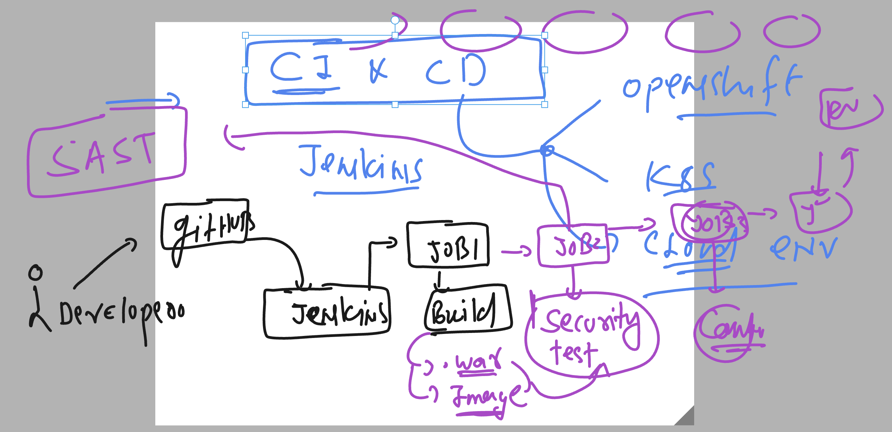

# cloud4c_jenkinsb1

## Adding security feature in jenkins pipeline to scan static data like war file or docker image or github repo itself 



### store security check in a file -- which data can be used lator to analysse

```
pipeline {
    agent any

    stages {
        stage('taking webapp code from github URL') {
            steps {
                echo 'using git inbuild function to clone url'
                git 'https://github.com/redashu/ashu-cisco-webUI.git'
                // verify 
                sh 'ls | grep -i html'
            }
        }
        // lets do security check againts git repo before build
        stage('before build security scanning on the source code'){
            steps {
                echo 'doing security check'
                sh 'trivy repo https://github.com/redashu/ashu-cisco-webUI.git  >check1.txt'
                sh 'cat check1.txt'
                
            }
        }
    }
}

```

### we can also add some tool to detect mistakely added keys on code

```
pipeline {
    agent any

    stages {
        stage('taking webapp code from github URL') {
            steps {
                echo 'using git inbuild function to clone url'
                git 'https://github.com/redashu/ashu-cisco-webUI.git'
                // verify 
                sh 'ls | grep -i html'
            }
        }
        // lets do security check againts git repo before build
        stage('before build security scanning on the source code'){
            steps {
                echo 'doing security check'
                sh 'trivy repo https://github.com/redashu/ashu-cisco-webUI.git  >check1.txt'
                sh 'cat check1.txt'
                
            }
        }
        // checking keys 
        stage('checking private key in source code'){
            steps {
                echo 'we are using trufflehog tool to detect'
                sh 'docker run --rm  trufflesecurity/trufflehog:latest github --repo https://github.com/redashu/ashu-cisco-webUI.git --json  >keycheck.txt'
                sh 'cat  keycheck.txt   |  grep -i private'
                echo 'we detected Key'
                // terminate pipeline
                
            }
        }
    }
}

```

### adding image build after key check 

```
pipeline {
    agent any

    stages {
        stage('taking webapp code from github URL') {
            steps {
                echo 'using git inbuild function to clone url'
                git 'https://github.com/redashu/ashu-cisco-webUI.git'
                // verify 
                sh 'ls | grep -i html'
            }
        }
        // lets do security check againts git repo before build
        stage('before build security scanning on the source code'){
            steps {
                echo 'doing security check'
                sh 'trivy repo https://github.com/redashu/ashu-cisco-webUI.git  >check1.txt'
                sh 'cat check1.txt'
                
            }
        }
        // checking keys 
        stage('checking private key in source code'){
            steps {
                echo 'we are using trufflehog tool to detect'
                sh 'docker run --rm  trufflesecurity/trufflehog:latest github --repo https://github.com/redashu/ashu-cisco-webUI.git --json  >keycheck.txt'
                sh 'cat  keycheck.txt' 
            }
        }
        // dockerpipeline to build docker image 
        stage('building image using docker pipeline'){
            steps {
                echo 'using docker pipeline to build image'
                script {
                    def imageName = "dockerashu/ashuweb"
                    def imageTag  = "sec-check$BUIlD_NUMBER"
                    // calling build function
                    docker.build(imageName + ":" + imageTag, "-f Dockerfile .")
                }
                // verify image build
                sh 'docker images | grep dockerashu'
            }
        }
    }
}

```


