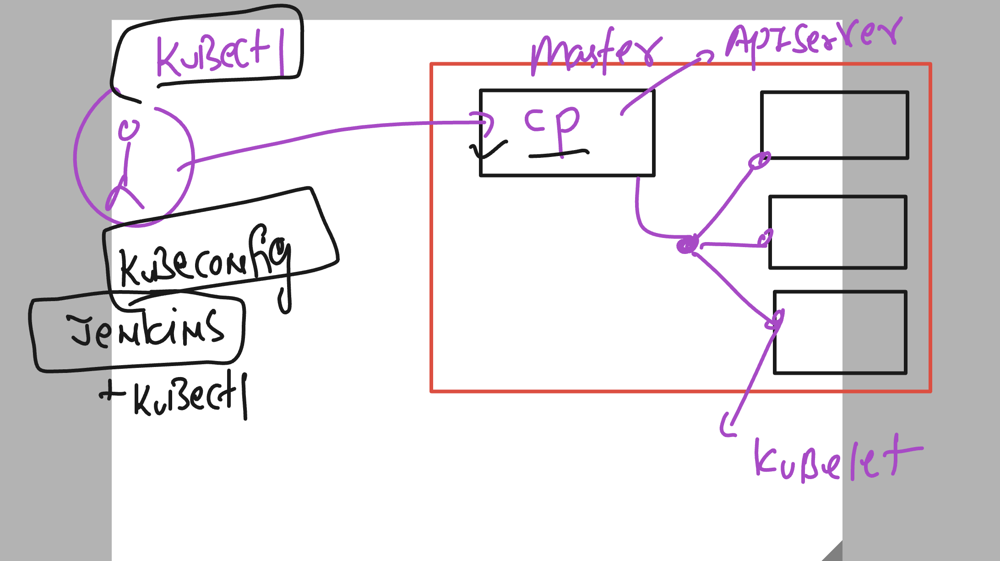

# cloud4c_jenkinsb1

### jenkins and k8s integration understanding 



### adding k8s deployment in ci pipeline 

```
pipeline {
    agent any

    stages {
        stage('taking webapp code from github URL') {
            steps {
                echo 'using git inbuild function to clone url'
                git 'https://github.com/redashu/ashu-cisco-webUI.git'
                // verify 
                sh 'ls | grep -i html'
            }
        }
        // lets do security check againts git repo before build
        stage('before build security scanning on the source code'){
            steps {
                echo 'doing security check'
                sh 'trivy repo https://github.com/redashu/ashu-cisco-webUI.git  >check1.txt'
                sh 'cat check1.txt'
                
            }
        }
        // checking keys 
        stage('checking private key in source code'){
            steps {
                echo 'we are using trufflehog tool to detect'
                sh 'docker run --rm  trufflesecurity/trufflehog:latest github --repo https://github.com/redashu/ashu-cisco-webUI.git --json  >keycheck.txt'
                sh 'cat  keycheck.txt' 
            }
        }
        // dockerpipeline to build docker image 
        stage('building image using docker pipeline'){
            steps {
                echo 'using docker pipeline to build image'
                script {
                    def imageName = "dockerashu/ashuweb"
                    def imageTag  = "sec-check$BUIlD_NUMBER"
                    // calling build function
                    docker.build(imageName + ":" + imageTag, "-f Dockerfile .")
                }
                // verify image build
                sh 'docker images | grep dockerashu'
            }
        }
        // creating container using compose 
        stage('creating container and testing health page'){
            steps {
                echo 'running compose'
                sh 'docker-compose down'
                sh 'docker-compose up -d --build'
                sh 'docker-compose ps'
                // access page which mean container got created successfully 
                sh 'curl -f http://localhost:1990/health.html'
            }
        }
        // docker pipeline to push image to docker hub 
        stage('pushing image to docker hub'){
            steps {
                echo 'using docker pipeline plugin to push '
                script {
                    def imageName = "dockerashu/ashuweb"
                    def imageTag  = "sec-check$BUIlD_NUMBER"
                    def imageCred = "a7a29583-59b1-4391-a492-313c05498ea3"
                    docker.withRegistry('https://registry.hub.docker.com',imageCred){
                        docker.image(imageName + ":" + imageTag).push()
                    }
                }
            }
        }
        // creating deployment using above image
        stage('creating deployment'){
            steps {
                echo 'creating deployment using kubectl'
                sh 'kubectl creat deployment ashu-webapp --image dockerashu/ashuweb:sec-check$BUILD_NUMBER --port 80 --namespace ashu-app'
                // verify deployment 
                sh 'kubectl -n ashu-app get deploy | grep ashu'
                // verify pod status as well 
                sh 'sleep 10'
                sh 'kubectl -n ashu-app get pods | grep -i running'
            }
        }
     
    }
}

```
